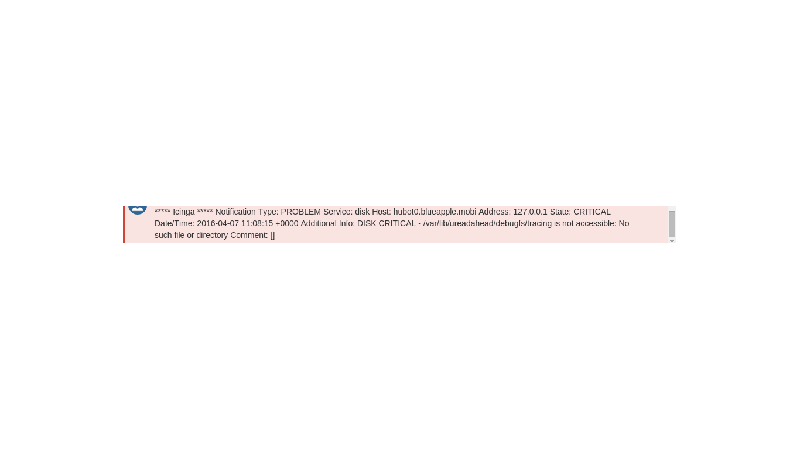

# hipchat_notify_2.0
Hipchat notification with API 2.0 to be used with ICINGA/Nagios

Table of Contents
=================

> [*Table of Contents*](#table-of-contents)
>
> [*Author*](#author)
>
> [*Audience*](#audience)
>
> [*Introduction*](#introduction)
>
> [*Ruby Script*](#ruby-script)
>
> [*Script used on server*](#script-used-on-server)
>
> [*Service notification*](#service-notification)
>
> [*Host notification*](#host-notification)
>
> [*Change in command.conf for Icinga
> server*](#change-in-command.conf-for-icinga-server)
>
> [*Example notification*](#example-notification)
>
> [*Roadmap*](#roadmap)

Author
======

Shubhamkr619@gmail.com

Audience 
=========

System Engineers and operation engineers

-   [*pops@gmail.com*](mailto:pops@gmail.com)

-   [*suyog.shirgaonkar@gmail.com*](mailto:suyog.shirgaonkar@gmail.com)

Introduction
============

Change the default mail notification of Icinga server to hipchat
notification using ruby code. This will allow a single place of
management of all the notification and alerts across organization. Let
that be service,host or business level alerts all can be managed and
monitored using hipchat and hubot will give certain advantage over
traditional alerting system.

1.  Proactive and reactive alerting

2.  Managed monitoring

3.  Single place of all the alerts

4.  Better communication and collaboration

5.  Integration with multiple tools in CI cycle

    a.  Jenkins

    b.  Chef

    c.  Bitbucket/Github

    d.  Jira

    e.  Confluence …. Etc

As per plan once Elastalert is implemented Hipchat will support business
and revenue alerts, and hopefully with event based proactive/reactive
handling or issues.

Ruby Script
===========

Need to create a Ruby script in order to make sure that we can send
messages from a single server. Idea here is to be able to configure
icinga server to send message to custom user groups and Hipchat account.

We are going to use a Ruby gem called hipchat which will support API
version 2.0. In order for script to work we need to install 2 gems,

1.  Hipchat

2.  Trollop

  ----------------------------
  \# apt-get install ruby -y

  \# gem install hipchat

  \# gem install trollop
  ----------------------------

  ------------------------------------------------------------------------------------------------------------------------------------------------------------------------
  \#!/usr/bin/env ruby

  require 'hipchat'

  require 'trollop'

  \#

  \# Provides a hipchat notifier with minimal requirements.

  \# Post the nofication to room

  \#

  \# Docs: http://wiki.opscode.com/display/chef/Exception+and+Report+Handlers

  \#

  \# Install - add the following to your client.rb:

  \# gem install hipchat \# Configure CLI entries

  \# gem install trollop \# configure commandline option parser

  module HipChat

  class NotifyRoomCli

  def initialize(api\_token, room\_name, msg, options={})

  defaults = { hipchat\_options: {api\_version: 'v2',server\_url: 'https://api.hipchat.com'}, msg\_options: {:notify =&gt; true}, excluded\_envs: \[\], msg\_prefix: ''}

  options = defaults.merge(options)

  @api\_token = api\_token

  @room\_name = room\_name

  @msg = msg

  @hipchat\_options = options\[:hipchat\_options\]

  @msg\_options = options\[:msg\_options\]

  @msg\_prefix = options\[:msg\_prefix\]

  @excluded\_envs = options\[:excluded\_envs\]

  @to\_user=options\[:name\]

  case

  when options\[:alerttype\].match(/warning/i)

  @color = 'yellow'

  when options\[:alerttype\].match(/critical/i)

  @color = 'red'

  when options\[:alerttype\].match(/info/i)

  @color = 'green'

  end if options\[:alerttype\]

  end

  def report

  if @msg

  @msg\_options\[:color\]=(@color || 'yellow')

  client = HipChat::Client.new(@api\_token, @hipchat\_options)

  client\[@room\_name\].send(@to\_user, \[@msg\_prefix, @msg\].join(' '), @msg\_options)

  end

  end

  end

  end

  begin

  opts = Trollop::options do

  opt :message, "Use monkey mode" ,:type =&gt; :string \# flag --monkey, default false

  opt :name, "Monkey name", :type =&gt; :string \# string --name &lt;s&gt;, default nil

  opt :apitoken, "HIPCHAT API Token 2.0", :type=&gt; :string

  opt :roomname, "Room id from Hipchat", :type=&gt; :string

  opt :alerttype, "warning/critical/info", :type =&gt; :string

  end

  \[ :message, :apitoken, :roomname\].each do |key|

  Trollop::die "arguments required --\#{key}" unless opts\[key\]

  end

  hipchat=HipChat::NotifyRoomCli.new(opts\[:apitoken\],opts\[:roomname\],opts\[:message\],opts)

  hipchat.report

  rescue Errno::ENOENT =&gt; err

  abort "hip\_chat\_cli: \#{err.message}"

  end
  ------------------------------------------------------------------------------------------------------------------------------------------------------------------------

Script used on server
=====================

following is a script which should which we need to configure to use
this code with a icinga server

Service notification
--------------------

  --------------------------------------------------------------------------------------------------------------------------------------------------------------
  root@hubot0:/etc/icinga2/scripts\# cat hipchat-service-notification.sh

  \#!/bin/sh

  template=\`cat &lt;&lt;TEMPLATE

  \*\*\*\*\* Icinga \*\*\*\*\*

  Notification Type: \$NOTIFICATIONTYPE

  Service: \$SERVICEDESC

  Host: \$HOSTALIAS

  Address: \$HOSTADDRESS

  State: \$SERVICESTATE

  Date/Time: \$LONGDATETIME

  Additional Info: \$SERVICEOUTPUT

  Comment: \[\$NOTIFICATIONAUTHORNAME\] \$NOTIFICATIONCOMMENT

  TEMPLATE

  \`

  \#/usr/bin/printf "%b" "\$template" | mail -s "\$NOTIFICATIONTYPE - \$HOSTDISPLAYNAME - \$SERVICEDISPLAYNAME is \$SERVICESTATE" \$USEREMAIL

  dir="\$(readlink -f \$(dirname \$0))"

  ruby \$dir/notify --message "\$(/usr/bin/printf "%b" "\$template")" --name icinga --apitoken "&lt;TOKEN&gt;" --roomname 2614946 --alerttype "\$SERVICESTATE"
  --------------------------------------------------------------------------------------------------------------------------------------------------------------

Host notification
-----------------

  -------------------------------------------------------------------------------------------------------------------------------------------------------
  root@hubot0:/etc/icinga2/scripts\# cat mail-host-notification-hipchat.sh

  \#!/bin/sh

  dir="\$(readlink -f \$(dirname \$0))"

  template=\`cat &lt;&lt;EOF

  HOST DOWN \$HOSTALIAS; Address: \$HOSTADDRESS; State: \$HOSTSTATE ; Date/Time: \$LONGDATETIME

  Additional Info: \$HOSTOUTPUT

  Comment: \[\$NOTIFICATIONAUTHORNAME\] \$NOTIFICATIONCOMMENT

  EOF

  \`

  ruby \$dir/notify --message "\$(/usr/bin/printf "%b" "\$template")" --name icinga --apitoken "&lt;TOKEN&gt;" --roomname 2614946 --alerttype "warning"

  root@hubot0:/etc/icinga2/scripts\#
  -------------------------------------------------------------------------------------------------------------------------------------------------------

Change in command.conf for Icinga server
========================================

This will change the Icinga server to support the hipchat adapter ,

  -----------------------------------------------------------------------------------
  root@hubot0:/etc/icinga2/scripts\# cat ../conf.d/commands.conf

  /\* Command objects \*/

  object NotificationCommand "mail-host-notification" {

  import "plugin-notification-command"

  command = \[ SysconfDir + "/icinga2/scripts/mail-host-notification-hipchat.sh" \]

  env = {

  NOTIFICATIONTYPE = "\$notification.type\$"

  HOSTALIAS = "\$host.display\_name\$"

  HOSTADDRESS = "\$address\$"

  HOSTSTATE = "\$host.state\$"

  LONGDATETIME = "\$icinga.long\_date\_time\$"

  HOSTOUTPUT = "\$host.output\$"

  NOTIFICATIONAUTHORNAME = "\$notification.author\$"

  NOTIFICATIONCOMMENT = "\$notification.comment\$"

  HOSTDISPLAYNAME = "\$host.display\_name\$"

  USEREMAIL = "\$user.email\$"

  }

  }

  object NotificationCommand "mail-service-notification" {

  import "plugin-notification-command"

  command = \[ SysconfDir + "/icinga2/scripts/hipchat-service-notification.sh" \]

  env = {

  NOTIFICATIONTYPE = "\$notification.type\$"

  SERVICEDESC = "\$service.name\$"

  HOSTALIAS = "\$host.display\_name\$"

  HOSTADDRESS = "\$address\$"

  SERVICESTATE = "\$service.state\$"

  LONGDATETIME = "\$icinga.long\_date\_time\$"

  SERVICEOUTPUT = "\$service.output\$"

  NOTIFICATIONAUTHORNAME = "\$notification.author\$"

  NOTIFICATIONCOMMENT = "\$notification.comment\$"

  HOSTDISPLAYNAME = "\$host.display\_name\$"

  SERVICEDISPLAYNAME = "\$service.display\_name\$"

  USEREMAIL = "\$user.email\$"

  }

  }
  -----------------------------------------------------------------------------------

Example notification
====================

{width="6.268055555555556in"
height="3.5277777777777777in"}

Roadmap
=======

1.  Add hipchat user for Icinga server

2.  Configure to talk to groups using token from user settings in
    > hipchat

3.  Change notification files and update token+room\_ids

All these steps are required to make sure hubot can take actions on
events. For now hubot can not take actions if the user Hubot and
notifying user is matched. It is required to prevent race conditions.

